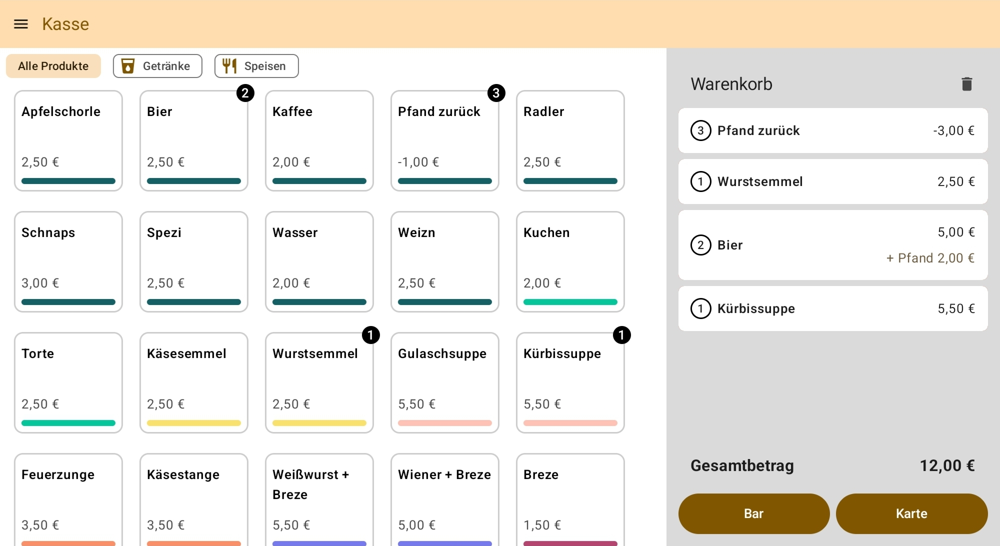
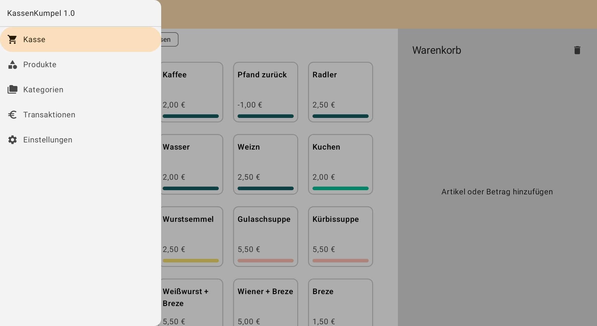
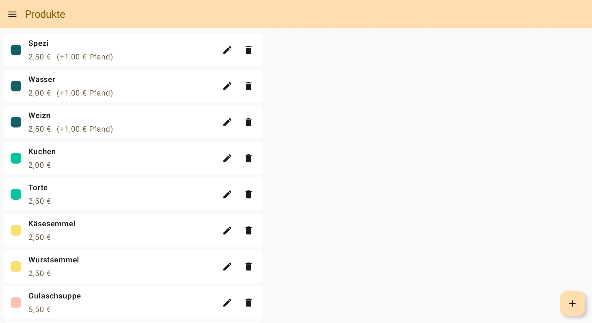

# KassenKumpel

Digitales Kassensystem für den Point-of-Sale bei Veranstaltungen.

Android App ohne Cloud-Anbindung, die alle Daten lokal speichert.

## Projektstatus

Dieses Projekt wird aktiv entwickelt und befindet sich im Moment in einer frühen Entwicklungsphase.

## Features (umgesetzt und geplant)

- [x] Verwaltung von Produkten
    - [x] Produkte hinzufügen
    - [x] Produkte bearbeiten
    - [x] Produkte löschen
    - [ ] Produkte mit Aufpreis (z.B. Pfand)
    - [ ] Produkte mit negativen Preisen (z.B. Pfandrückgabe, Rabatte)
- [ ] Verwaltung von Kategorien
    - [x] Kategorien hinzufügen
    - [x] Kategorien bearbeiten
    - [x] Kategorien löschen
    - [ ] Icons von Kategorien auswählen
    - [ ] Produkte Kategorien zuweisen
- [ ] Point of Sale
    - [x] Auswahl der Produkte
    - [x] Berechnung des Gesamtpreises im Warenkorb
    - [x] Entfernen einzelner Produkte aus dem Warenkorb
    - [x] Entfernen aller Produkte aus dem Warenkorb
    - [x] Bearbeiten der Anzahl der Produkte im Warenkorb
    - [ ] Produkte nach Kategorie filtern
    - [ ] Hinzufügen von Individuellen Beträgen (ohne Produkt)
        - [ ] Kommentar für individuelle Beträge
        - [ ] Negative individuelle Beträge
- [x] Barzahlung mit Rückgeldberechnung
- [ ] Kartenzahlung mit SumUp Geräten
    - [ ] Rückbuchung von Kartenzahlungen
- [ ] Anschreiben (Gesamtzahlung am Ende einer Veranstaltung)
    - [ ] Anschreibungs-Konten anlegen
    - [ ] Warenkorb in Anschreibungs-Konto transferieren
    - [ ] Anschreibungs-Konten bezahlen
    - [ ] Detailansicht Anschreibungs-Konto nach Transaktion
    - [ ] Detailansicht Anschreibungs-Konto Gesamt
- [x] Speichern aller Transaktionen
    - [ ] Export der Transaktionen als CSV
    - [ ] Statistik über gekaufte Produkte
- [ ] Quittung für Transaktionen (als PDF per E-Mail oder auf dem Gerät gespeichert)
- [ ] Konfiguration der aktivierten Features (Barzahlung, Kartenzahlung, Anschreiben)

## Screenshots

## Technologie

Android mit Kotlin, Jetpack Compose, Room, Hilt und Material 3

## Testabdeckung

Im Moment gibt es keinerlei automatisierte Tests der App.

## Contributions

Sind gerne gesehen. Einfach nen PR stellen.